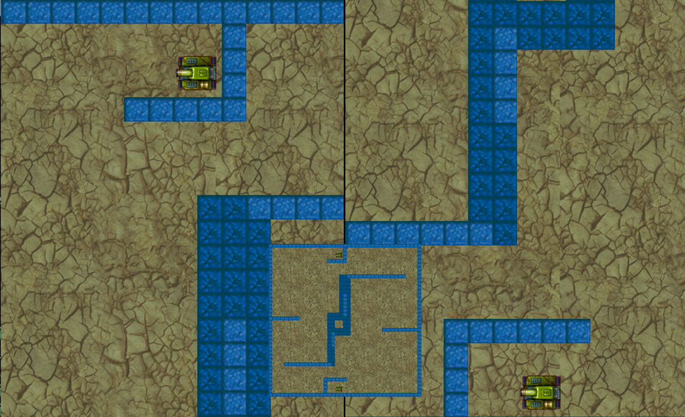
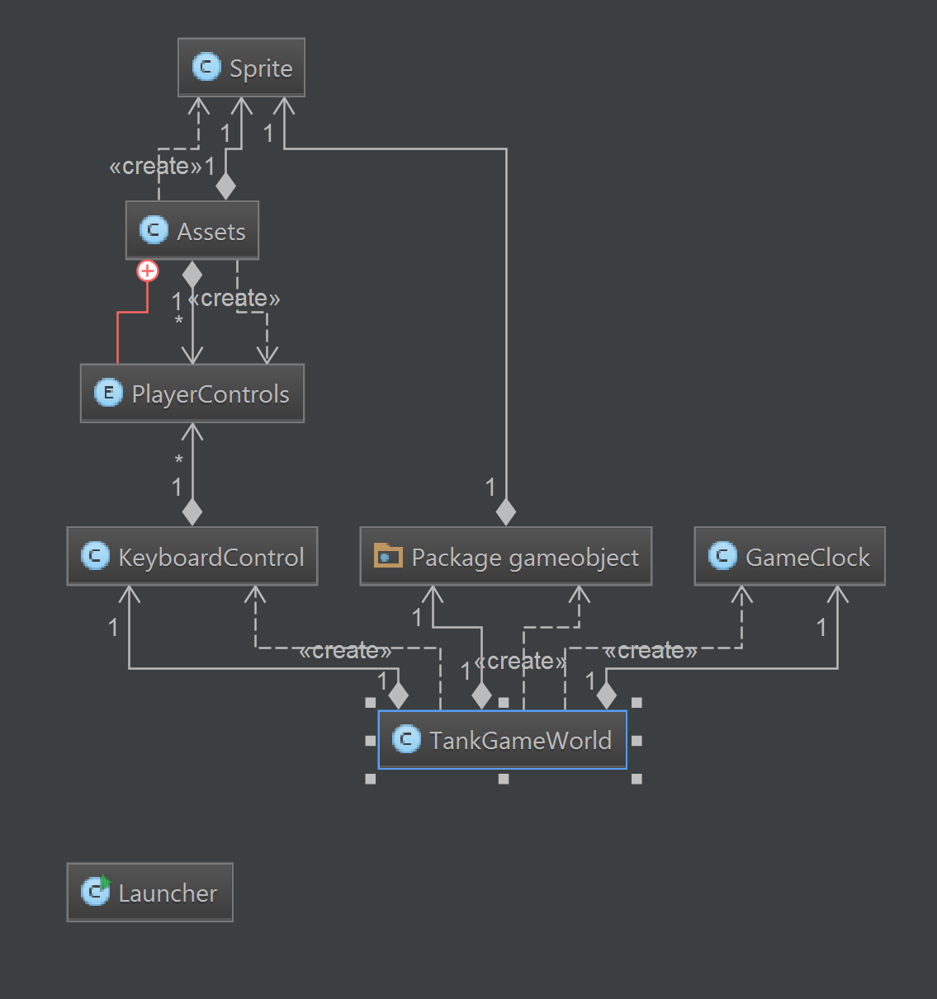

# TankWarsGame
A two player shooter game where the objective of the game is to eliminate the enemy with the tanks bullets. Each tank has a certain amount of lives and health points. Each hit will change the color of the lives which indicate the amount of health points left before losing a life. After one players lives are zero the game will end. There is a split screen for each player to have and a minimap. There are destructible walls in the center of the map that will regenerate after a few seconds. Just in case a player wants to spam the shoot button they won’t get far. There is a limit of five bullets per player to have on the screen at once which will regenerate. Each bullet will have a slight delay to make sure there's some strategy to this shooter. 

## High level class hierarchy design 

